# EVPN-BGP-VxLAN
## Topologia del Laboratorio

## Tipos de rutas EVPN

- [x] Tipo 1 – Ethernet Auto-Discovery (EAD)
- Descubrimiento de servicios EVPN y señalización de multihoming.

- [x] Tipo 2 – MAC/IP Advertisement
- Anuncia direcciones MAC y opcionalmente IP (host reachability).

- [x] Tipo 3 – Inclusive Multicast Ethernet Tag (IMET)
- Usada para BUM traffic (Broadcast, Unknown unicast, Multicast).

- [x] Tipo 4 – Ethernet Segment Route (ES)
- Identifica un Ethernet Segment (multihoming, DF election).

- [x] Tipo 5 – IP Prefix Route
- Anuncio de prefijos IP (EVPN L3 / IRB, routing puro).

- [x] Tipo 6 – Selective Multicast Ethernet Tag (SMET)
- Multicast selectivo (menos común, optimización multicast).

- [x] Tipo 7 – IGMP Join Synch
- Sincronización IGMP entre PE (poco usado).

- [x] Tipo 8 – MAC Mobility Extended Community (extensión asociada)
- Mejora de movilidad MAC (algunos vendors lo listan como tipo independiente).

## SESIONES EVPN BGP LEAFs

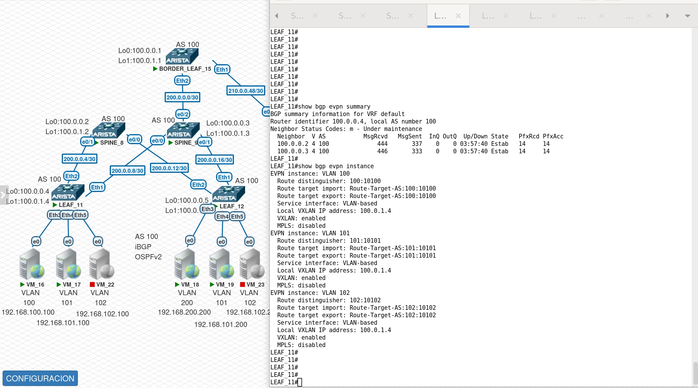
              
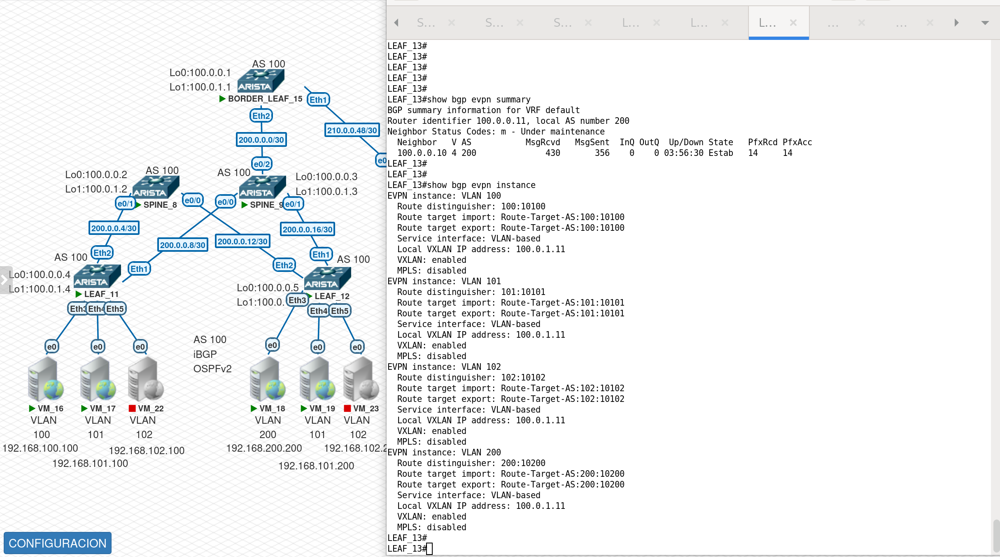

- [x] show bgp evpn summary

Estas imagenes muestran el estado general del control-plane EVPN mediante BGP.
Se observa que las sesiones BGP EVPN están establecidas correctamente entre los dispositivos (Leaf, Spine y Border Leaf), confirmando conectividad del overlay EVPN.

Los contadores de prefijos recibidos validan que:
EVPN está intercambiando información de forma activa
Los Route Reflectors (Spines) están funcionando correctamente
Los Border Leafs reciben y anuncian rutas EVPN inter-DC

- [x] show bgp evpn instance

Adicionalmente estas imagenes muestran las instancias EVPN activas, asociando:

- VLANs
- VNIs
- RT-RD

Se valida que:
Cada VLAN está correctamente mapeada a su VNI
El diseño lógico del overlay coincide con la arquitectura planeada

##  Rutas EVPN Tipo 5 - Prefijos  IP

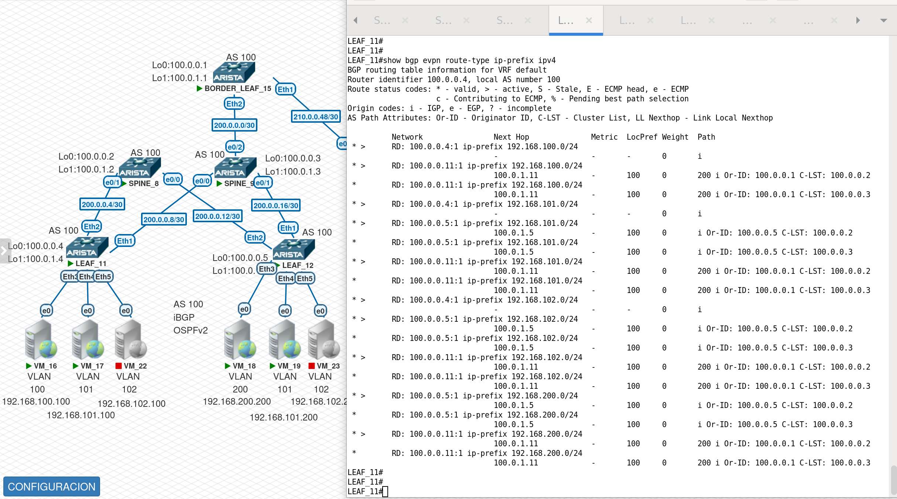
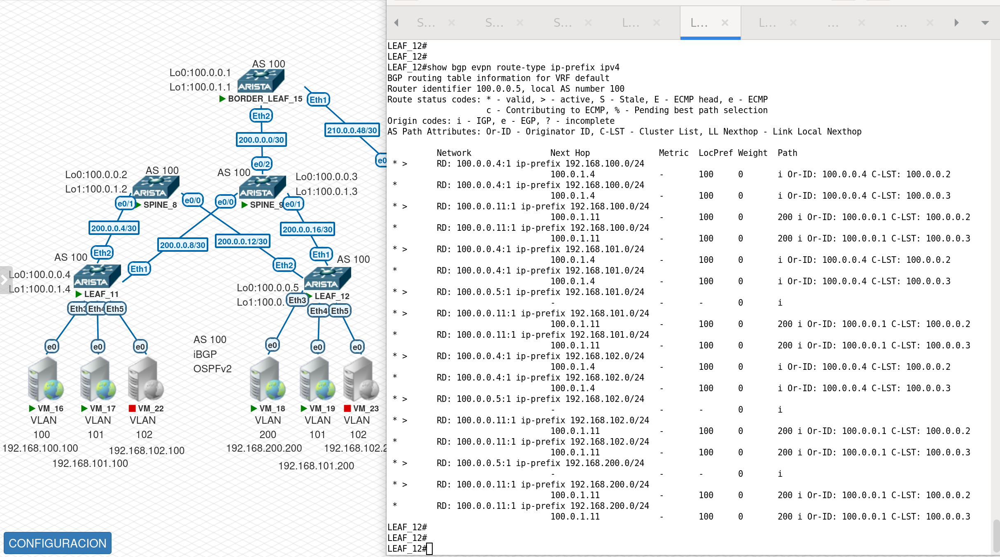              
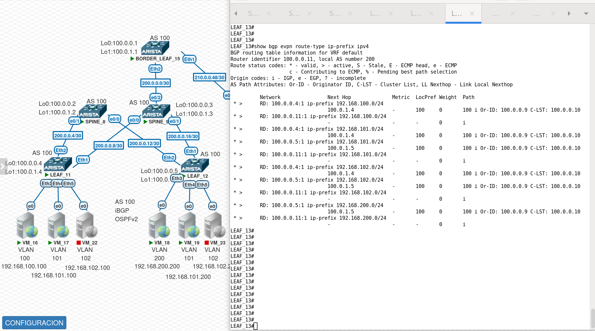

- [x] show bgp evpn route-type ip-prefix ipv4

En estas imagenes se visualizan rutas EVPN Route-Type 5 (IP Prefix Routes), utilizadas para conectividad de capa 3 entre VRFs y entre Data Centers.

Se confirma que:
- Las subredes de los diferentes DCs son anunciadas vía EVPN
- El Next-Hop apunta a los VTEPs remotos
- Las rutas están aprendidas vía iBGP/eBGP EVPN según el rol del equipo

Conclusión:
- La conectividad inter-DC se realiza a nivel L3 mediante EVPN, sin extender dominios L2.

##  Rutas EVPN Tipo 2 - Anuncio  MAC/IP

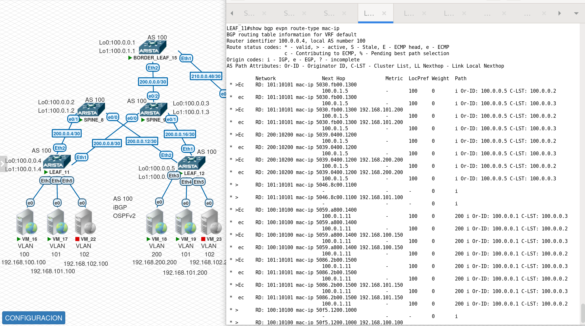
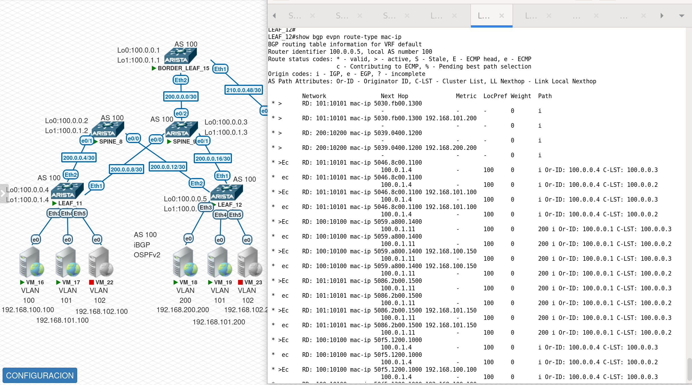              
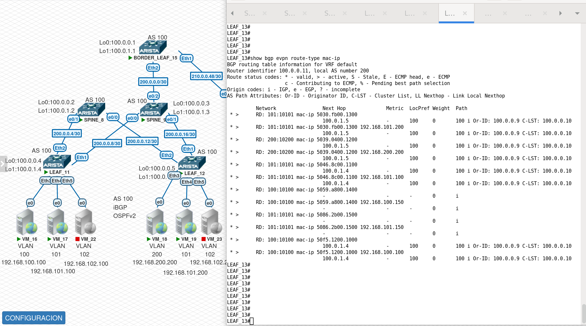

Estas imagenes muestran las rutas EVPN Route-Type 2 (MAC/IP Advertisement) en los Leafs, donde se asocian direcciones MAC con direcciones IP.

Se valida que:

- Los endpoints locales son anunciados correctamente

- EVPN distribuye información MAC/IP dentro del dominio del Data Center

- El control-plane VXLAN aprende endpoints sin flooding innecesario

# Tuneles VxLAN

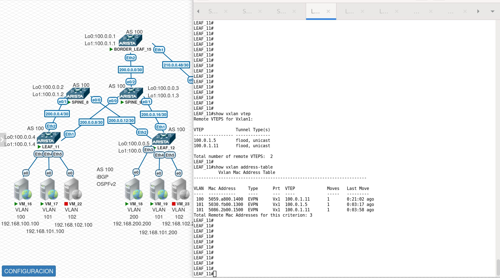
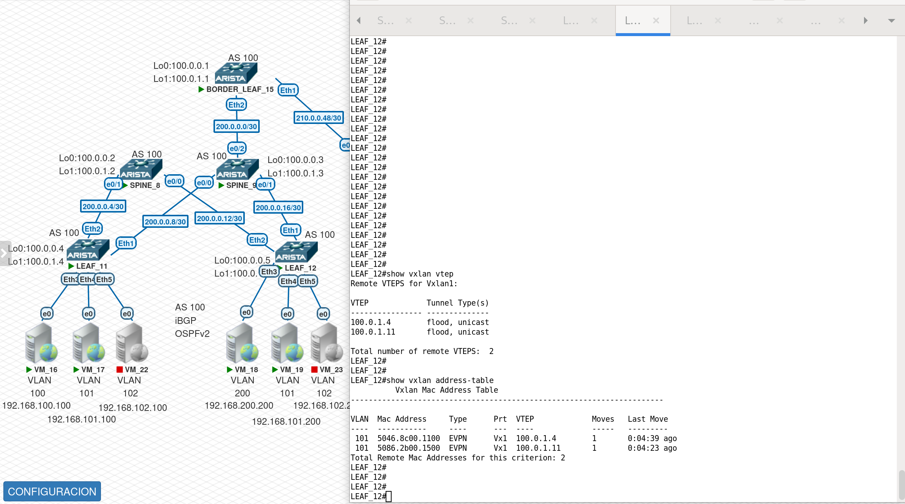              
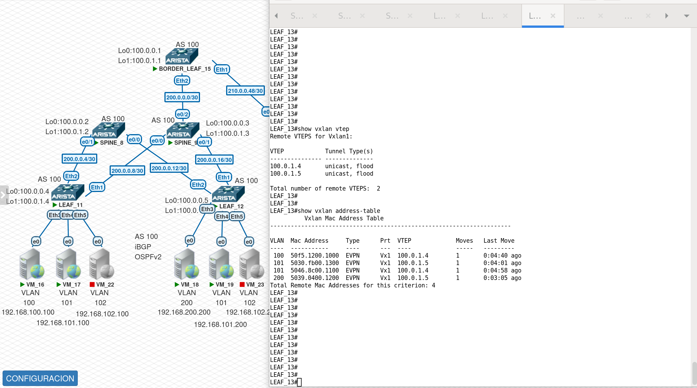

Estas imagenes muestra los VTEPs remotos descubiertos dinámicamente mediante EVPN.

Se observan VTEPs con túneles VXLAN activos en modos:

- Unicast → tráfico dirigido (data-plane optimizado)
- Flood → tráfico BUM (Broadcast, Unknown unicast, Multicast)

Adicionalmente se presenta la tabla de direcciones VXLAN, donde se observa la asociación entre:

- MAC addresses
- VLAN
- VTEPs remotos

Se confirma que:

- Las MAC remotas se aprenden vía EVPN
- No se depende de flooding continuo
- El overlay VXLAN opera de forma eficiente y escalable

## PRUEBAS DE CONECTIVIDAD INTER e INTRA DC

Estas validaciones confirman el correcto funcionamiento del overlay EVPN-VXLAN, tanto en conectividad intra-DC como inter-DC a nivel L3, asegurando escalabilidad, segmentación y control eficiente del tráfico. Se verifica la conectividad entre los diferentes host y gatways en el caso donde los hosts no estan encendidos.  

              
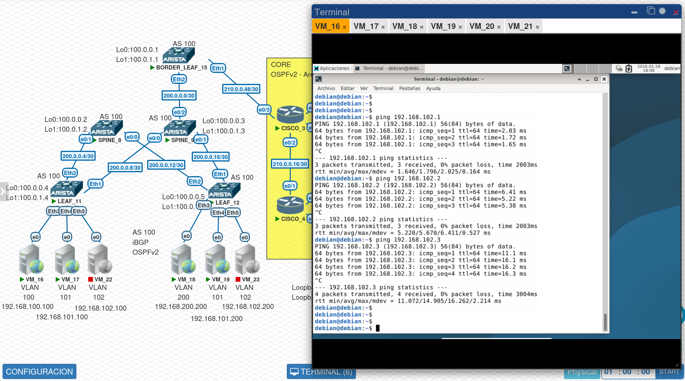
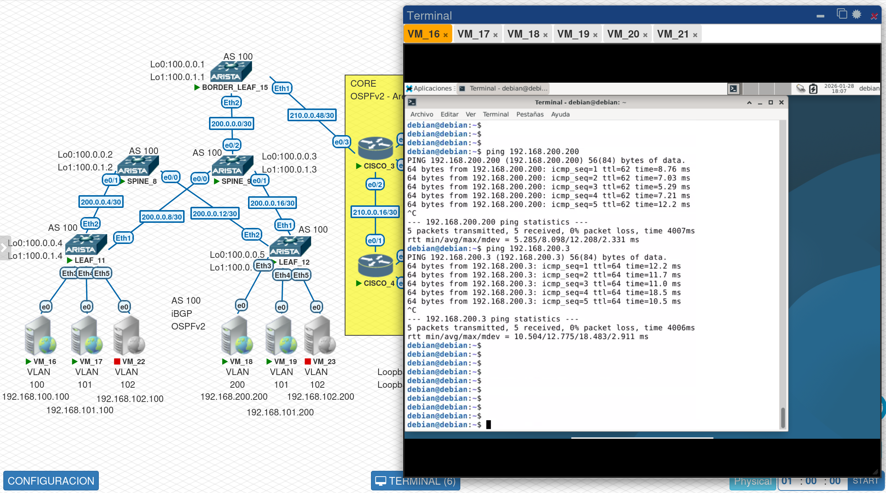
